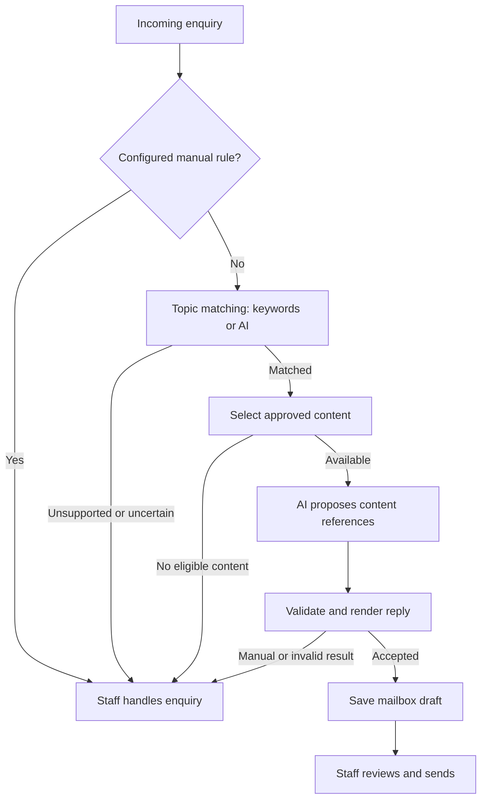

# Company Email Assistant

[](https://github.com/bartlomiejnoszka/company-email-assistant/actions/workflows/ci.yml)
[](composer.json)
[](LICENSE)

A self-hosted Symfony application that turns approved company knowledge into email drafts for staff review.

Recurring customer enquiries often need the same facts, checklists and price conditions. Staff still need to understand the question, choose the relevant information and check the reply. This assistant matches enquiries to configured topics, proposes approved content blocks and saves validated drafts in the mailbox. Staff review and send them from their existing mail client. Unsupported or uncertain enquiries require manual handling.

## What it does

- Matches configured topics using keywords or AI-assisted semantic classification, then validates the proposed content references locally.
- Preserves approved prices, complete conditions and signatures literally. Reply blocks are literal by default; optional mixed editing has additional guards and still requires review.
- Provides an authenticated Twig configuration panel with English and Polish interfaces, complete-package validation, immutable YAML snapshots and stale-version checks.
- Exposes OAuth-protected MCP tools for configuration management and response previews using the same application services as the panel and mailbox processing.
- Tracks mailbox message identity and pending operations to avoid repeating draft creation after uncertain external writes.

## How a reply becomes a draft



This shows the default draft workflow. Configuration validation precedes mailbox access; recovery of interrupted operations is described in the [engineering walkthrough](docs/showcase.md#recovering-uncertain-mailbox-operations).

## Fictional examples

These scenarios use the [repair workshop configuration](examples/repair/company.yaml), which selects topics by keywords and keeps reply blocks literal. They demonstrate expected behaviour, not measured AI accuracy.

| Enquiry | Expected behaviour |
| --- | --- |
| "What should I bring for a device repair?" | Matches the repair topic. A valid proposal can produce a draft containing the approved checklist: "Please bring the device and its purchase receipt." Staff review it before sending. |
| "Do you offer parking?" | Matches no configured topic. Requires staff handling, with no generated draft. |
| "I have a dispute about a repair." | The configured `dispute` rule requires staff handling before AI generation, with no generated draft. |

See the [engineering walkthrough](docs/showcase.md) for the illustrative draft, implementation links and tests behind these boundaries.

## Engineering decisions

The application is a modular monolith with plain PHP domain rules, application services that coordinate ports, and infrastructure adapters for Symfony, YAML, SQLite, IMAP and OpenAI. Company-specific content stays in configuration. One installation uses the same response pipeline for mailbox drafts and MCP previews, and the same configuration service for panel and MCP edits.

Read the [engineering walkthrough](docs/showcase.md), [architecture](docs/architecture.md) and [testing guide](docs/testing.md) for the design, failure handling and verification approach.

## Limits and review boundaries

- Each installation serves one company and one mailbox; multiple companies need isolated installations.
- Staff must review drafts. Local validation and mixed-editing guards do not prove semantic correctness or price applicability.
- Attachment contents and previous thread context are not interpreted. Messages with attachments are flagged for review.
- OpenAI is the initial AI adapter. Enquiry text and relevant configuration content are sent to an external API; self-hosting the application does not make inference local.
- Normal processing creates drafts. Automatic sending is an explicit, narrowly allowlisted test mode, described below.
- SQLite, process locks and atomic snapshot activation require local shared storage for each installation.

## Requirements

PHP 8.4+ with DOM, mbstring, PDO SQLite and OpenSSL, Composer 2, and Node.js 22+ for CSS. IMAP uses verified TLS; optional test SMTP delivery uses implicit TLS. SQLite and snapshot storage require a local filesystem shared by the panel and scheduled command.

## Local setup

```sh
composer install
npm ci --ignore-scripts
npm run build:css
mkdir -p var/company
cp examples/repair/*.yaml var/company/
```

Create an ignored `.env.local` file. Set a randomly generated `APP_SECRET`, `COMPANY_CONFIG_DIR="%kernel.project_dir%/var/company"`, and `UI_LOCALE=en` or `pl`. Defaults contain only fictional example data.

```sh
php bin/console app:owner:configure
php bin/console doctrine:migrations:migrate --no-interaction
php bin/console lint:container
php -S 127.0.0.1:8088 -t public public/router.php
```

Open http://127.0.0.1:8088/login. Provisioning writes the generated owner password to `var/identity/connection.txt` with mode 0600; no credentials are printed. The same owner credential authorizes MCP consent. `app:mcp:configure` remains an alias. Existing identities are preserved.

No mail is processed by starting the web server. To enable draft processing, configure `IMAP_HOST`, `IMAP_USERNAME`, `IMAP_PASSWORD`, `OPENAI_API_KEY`, `OPENAI_MODEL` and `EMAIL_START_AT` (ISO-8601 with timezone) in your private environment file. Use the existing database and start boundary when upgrading.

```sh
php bin/console app:email:generate-drafts --dry-run --limit=5
php bin/console app:email:generate-drafts --limit=50
```

Dry runs call AI and print proposed content but do not mutate mail or processing records. Keep their output private. Normal processing saves drafts. Optional test sending requires both `EMAIL_TEST_AUTO_SEND=1` and a nonempty JSON `EMAIL_AUTO_SEND_ALLOWLIST` of exact To recipients; configure `SMTP_DSN` as `smtps://...:465`. Single explicit To matching remains narrow; uncertainty after sending is never automatically retried.

## Company configuration

- `company.yaml`: `schema_version: 1`, company identity and reply preferences.
- `knowledge.yaml`: topics, approved facts and clarification questions.
- `pricing.yaml`: approved prices and complete conditions.

Copy an example from `examples/repair` or `examples/notary` to writable private storage. These are fictional demonstrations, not legal or pricing templates. Companies do not require PHP changes. UI language is independent of reply language; approved content is never automatically translated.

The panel edits all three YAML files together and preserves their text. Saves validate the complete package, reject stale versions and atomically publish immutable snapshots. After the first save, use the panel/MCP; root files are inactive. See [configuration reference](docs/panel/en/dokumentacja.md).

## Existing installations

```sh
php bin/console app:configuration:import-legacy /path/to/old-office /path/to/new-company
```

The destination must not exist. Import preserves approved content and IDs, copies source/history to a read-only archive, validates the result and initializes generic snapshot history. Original files and the mail database remain unchanged. Point `COMPANY_CONFIG_DIR` at the new directory after reviewing `migration-report.json`. See [migration notes](docs/migration.md).

## MCP and deployment

See [MCP setup](docs/mcp.md), [Docker deployment](deploy/README.md), and [architecture](docs/architecture.md). Public deployments require HTTPS, private credentials, writable persistent storage and an explicit `MCP_HOST`. The panel requires owner login; `/mcp` always requires bearer tokens.

## Development

```sh
composer check
composer analyse
composer cs:check
npm run build:css
composer audit
```

Normal tests use fakes and temporary company data. The real-mailbox test is opt-in and must only use a dedicated seeded account; see [testing](docs/testing.md). Contribution instructions are in [CONTRIBUTING.md](CONTRIBUTING.md). This project is licensed under [MIT](LICENSE).
