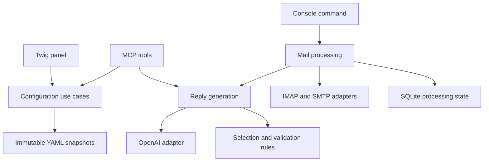

# Architecture

One company, one mailbox, one deployable Symfony application. Configuration supplies company identity, content and preferences; executable code has no customer-specific rules.

## Modules

| Module | Responsibility |
| --- | --- |
| Configuration | Validated company model, editing preferences, snapshot operations and legacy import |
| Reply | Selection, proposal validation, rewriting guards, rendering and the shared response pipeline |
| MailProcessing | Source identity, eligibility, recoverable state and mailbox orchestration |
| Identity | Shared owner credentials, sessions, OAuth clients and tokens |
| Interface | Console commands, HTTP controllers and MCP tools |

Domain classes use plain PHP and contain no framework or persistence annotations. Application services coordinate domain rules and injected ports. Infrastructure owns YAML, Doctrine XML mappings, IMAP, SMTP, provider SDKs and the system clock. Identity remains an infrastructure-oriented authentication module, avoiding abstractions with no second implementation.

`ProcessMailbox` owns preflight, lock acquisition, recovery and processing. Its console adapter passes options and a reporting callback. `ResponseGenerator` is mailbox-independent and is shared by scheduled mail processing and MCP previews. `ConfigurationManager` is shared by panel and MCP adapters, with storage behind `ConfigurationStorage`.

External ports are `ConfigProvider`, `ConfigurationStorage`, `ProcessingState`, `Mailbox`, `ReplySender`, `DraftAi`, `Clock`, `MimeComposer`, `ContentExtractor`, and `RunLock`. Adapters are explicitly wired in Symfony. Additional providers must produce the same proposal/rewriting contracts and pass local validation; provider objects do not enter the domain. Reply generation returns an immutable `ReplyResult`; MCP serializes it at the boundary.

## Data and failure boundaries

An immutable configuration is loaded once for each operation. Semantic hashes sort mapping keys while preserving ordered lists; comments and map ordering do not change the hash. Stable content IDs survive migration.

Source processing identity remains mailbox + UIDVALIDITY + UID. SQLite stores metadata and identifiers, never raw correspondence. Processing and OAuth databases are separate. APPEND and SMTP persist pending state before side effects. Recovery searches for a stable draft Message-ID; uncertain outcomes never trigger duplicate APPEND or SMTP sends. Existing terminal records remain terminal after configuration changes.

Drafts are the default. Literal blocks, prices, full price conditions and signatures remain protected. Mixed editing is opt-in and cannot establish semantic equivalence; staff review is still required. Attachment contents and old thread context are not interpreted.

## Authentication

One provisioned owner credential is shared between panel login and OAuth consent. Panel sessions carry `ROLE_OWNER`; MCP bearer identities carry only granted configuration scopes. Separate firewalls prevent either credential type from silently granting the other access. Both login paths share the persistent global failed-attempt limit (10 per 15 minutes); successful login before the limit resets failures. Tokens enforce issuer, resource audience, lifetime and revocation.

## Deliberate limits

No shared-host tenant model, queue, plugin framework, distributed state store or case-management module. Scale to multiple companies through isolated installations. SQLite, locks and atomic renames assume local shared storage for each installation. Extract Composer packages only after a second concrete consumer exists.
